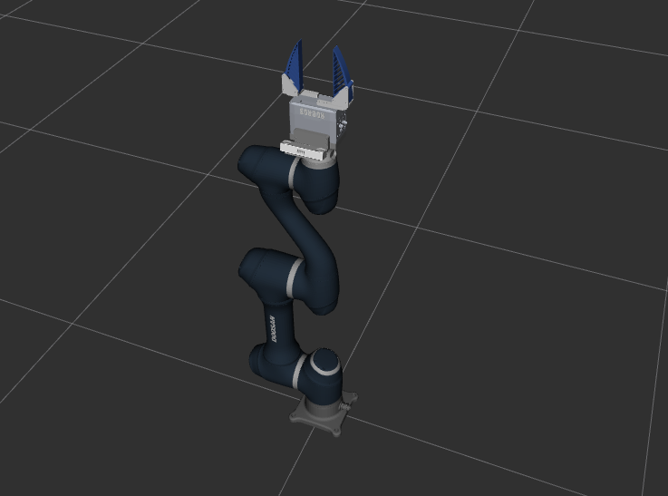

# Shunk Gripper Description
Robros Imitation Learning DS_A0509 Shunk Gripper manipulator URDF




## Installation

```bash
cd ~/catkin_ws/src
git clone https://github.com/menggu1234/shunk_gripper_description.git
cd ..
catkin_make
```

## Usage

```bash
roslaunch shunk_gripper_description display_gripper_only.launch
# or
roslaunch shunk_gripper_description display_a0509_robros.launch
```

## License

This project is licensed under the Apache-2.0 License - see the [LICENSE](LICENSE) file for details.