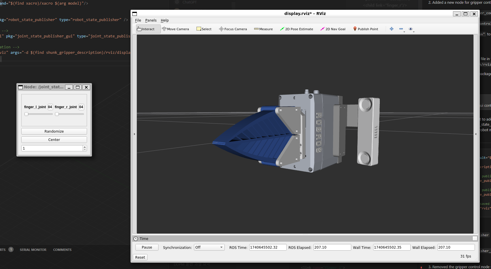

# Shunk Gripper Description

This package contains the URDF model for the SCHUNK gripper.



## Installation

```bash
cd ~/catkin_ws/src
git clone https://github.com/menggu1234/shunk_gripper_description.git
cd ..
catkin_make
```

## Usage

```bash
roslaunch shunk_gripper_description display.launch
```

## License

This project is licensed under the Apache-2.0 License - see the [LICENSE](LICENSE) file for details.
